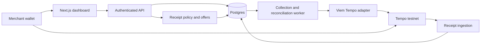

# Float: MVP build plan

Updated September 26, 2026. Target: Colosseum Crypto World's Fair, Tempo track.

## 1. Objective and honest baseline

Float evaluates a merchant's eligible stablecoin receipts, offers a small advance, and collects revenue-linked repayments within merchant-authorized spending limits.

Deliver a complete **testnet** lifecycle: explain an offer, authorize limited collection, transfer funds to the merchant, collect and reconcile repayments, and stop at payoff. Demonstrate an eligible merchant, suspicious receipts, and insufficient history with understandable decisions.

**Status: planning ready; implementation gates are not passed.** This repository contains documentation and a legacy hypothetical Python sketch. There is no verified Tempo integration, runnable application, validated underwriting model, or reproducible live transaction evidence. See [spike/RESULTS.md](spike/RESULTS.md). Earlier SDK/faucet assertions are not accepted as successful tests.

This is the implementation source of truth. Dates are targets, not proof of completion. Future agents should follow section 10 and record evidence before marking gates passed.

## 2. MVP scope

### Included

- One verified Tempo testnet, one supported TIP-20 test token, one treasury, and one supported merchant wallet integration.
- One open advance per merchant, enforced in the database. Open includes funding-pending, active, and paused advances.
- Immutable offer terms: principal, total obligation, collection percentage, period ceiling, authorization expiry, and estimated collection horizon.
- Principal-only repayment for the first demo: obligation equals principal. Future fees require explicit terms and accounting tests.
- Three labeled histories: eligible, suspicious, and insufficient evidence.
- Explainable eligibility rules, conservative sizing, and actual testnet treasury disbursement.
- A dedicated delegated key restricted to the chosen token's transfer function and treasury recipient, with recurring limit and expiry.
- A durable collection/reconciliation worker, merchant dashboard, and repeatable local demo.

### Deferred

Mainnet/real-money lending, multiple tokens/chains, pooled capital, concurrent advances, custom lending contracts, calibrated default probabilities, ARIMA, a separate Python API, Celery/RabbitMQ, and complex hosting. Python analysis notebooks are optional, not a runtime dependency.

### Product assumptions to validate early

Investigate small B2B service businesses receiving identifiable stablecoin payments. This is a customer hypothesis, not validated demand. Seek at least three operator interviews if accessible; record actual findings or explicitly state validation is incomplete. Investigate funding needs, receipt attribution, current alternatives, and willingness to authorize collections.

The demo uses a testnet treasury. The business narrative must identify a plausible future capital source, revenue model, and bearer of credit losses. Access keys cannot prevent revocation, an empty wallet, or redirected future sales. They do not guarantee repayment. Production credit/legal decisions are outside this MVP.

## 3. Repayment policy and trust boundaries

| Rule                             | Enforcement                            | Evidence                                            |
| -------------------------------- | -------------------------------------- | --------------------------------------------------- |
| Percentage of eligible receipts  | Float policy/ledger                    | Versioned receipt snapshot and calculation          |
| Maximum spending per period      | Tempo access key                       | Authorized ceiling and cumulative-limit test        |
| Allowed token/function/recipient | Tempo access-key scopes                | Valid transfer and rejection of other calls         |
| Stop at outstanding obligation   | Float policy/ledger                    | Final partial payment and no post-payoff collection |
| Expiry and revocation            | Tempo                                  | Rejection after expiry or confirmed revocation      |
| Genuine commercial sales         | Classification and supporting evidence | Reasons, provenance, and uncertainty                |

The chain does not determine genuine revenue, Float's repayment percentage, or outstanding debt. A recurring key alone does not provide a lifetime debt ceiling. Display these boundaries. Payoff in the database does not revoke the on-chain key: stop the worker, prompt merchant revocation, and display actual authorization status separately.

### Periods and budgets

Normal periods are 86,400 seconds, anchored to authorization time rather than implicitly to midnight. Persist the chain's period end and align revenue/collection windows with it.

Collect against eligible receipts from the preceding completed period, limited to receipts after confirmed funding. The first funded period may be partial. Pre-funding sales may support an offer but must not become repayment receipts.

Freeze a versioned snapshot and initial budget for collection period p:

    budget[p] = min(
      floor(rate_bps * max(0, eligible_receipts[p-1]) / 10000),
      agreed_period_ceiling,
      outstanding_at_budget_creation
    )

Before reserving a payment, hold a per-advance database lock. Subtract confirmed collections and unresolved reservations from this budget; subtract all unresolved reservations from the current confirmed outstanding obligation. Cap the new payment by both remainders, live on-chain remaining allowance, and spendable wallet balance after applicable fees.

An unresolved transaction blocks new collection for that advance. If it crosses a period boundary, retain its reservation and reconcile before using the new allowance. Do not assume an RPC timeout or restart means failure.

- Zero eligible receipts: no collection. Incomplete data: pause, not permission to reuse stale totals.
- Unused expired budgets do not accumulate as catch-up charges. Outstanding debt remains subject to future periods' own budgets.
- Late corrections/refunds are append-only adjustments, applied once to a later unprocessed snapshot. Carry negative adjustments forward until offset; never rewrite settled budgets to authorize another debit.
- Use integer token base units and integer basis points. Read token decimals; track transaction fees separately from principal.
- An accelerated demo period is permitted only when supported by the deployed chain and labeled with its actual duration. A short reset test is not evidence of a full 24-hour rollover.

## 4. Receipt evidence and underwriting

Store raw chain events separately from classification decisions. Preserve chain ID, transaction hash, log index, block reference, timestamp, sender, recipient, token, amount, and ingestion cursor. Choose canonical transfer events so memo/transfer representations do not double-count a payment. Confirm transaction success and the selected finality policy; record scan coverage and support gap-free, idempotent replay.

Each classification needs a version, reason, provenance, and review status. Exclude faucet funds, Float disbursements, known self-transfers, duplicates, and identified non-sales inflows. Account for refunds. Addresses/patterns alone do not prove independent customers or fraud; label suspected circular flows conservatively.

Keep two evidence modes explicit:

1. **Synthetic fixtures:** deterministic histories, including 30 simulated days where useful; labeled in every score and dashboard.
2. **Observed testnet activity:** real transaction-backed ingestion and money movement, without claims of genuine merchant sales or 30 days of operating history.

An illustrative offer may use historical fixtures. A live collection must use eligible post-funding testnet receipts, or be explicitly labeled as a testnet transfer driven by a simulated budget. Never silently combine synthetic and observed totals. Insufficient real history returns insufficient evidence in real-data mode.

### Policy v1

Use deterministic, versioned rules for eligible volume, active periods, history completeness, payer concentration, volatility, and suspicious flows. Freeze thresholds and score direction before implementation. Return eligible, declined, or insufficient_evidence, with reason codes and evidence references. Do not present a heuristic as default probability.

Use a conservative receipt baseline, such as a lower percentile of complete daily observations including zero-sales days. Specify the horizon and haircut. Bound principal by an absolute demo maximum and haircut-adjusted collection capacity:

    capacity = sum(min(
      floor(rate_bps * conservative_receipts[p] / 10000),
      period_ceiling
    ))
    principal <= floor(capacity * haircut_bps / 10000)

Match forecast units to collection-period duration. Record policy version, assumptions, horizon, inputs, and output with each offer. Estimated payoff dates are conditional.

Test beyond the presentation examples: concentrated legitimate revenue, volatility, self-funding, refunds, incomplete history, and inactivity. Keep additional evaluation cases separate from demo fixtures. These tests verify rules, not predictive credit accuracy.

## 5. Architecture and shared contracts

Use a TypeScript workspace: Next.js UI/API, documented **viem/tempo** integration, Postgres, and one persistent Node worker. Pin working versions during the spike. Do not build around hypothetical pytempo or assumed @tempo/sdk APIs. Postgres runs locally initially; hosting follows a reliable local lifecycle.

Put chain calls behind an adapter for deterministic testing. Fakes must be visibly identified and cannot generate live-looking evidence.

### Planned paths (not yet implemented)

| Path                | Responsibility                                               |
| ------------------- | ------------------------------------------------------------ |
| apps/web/           | UI, wallet connection, authenticated HTTP handlers           |
| apps/worker/        | Ingestion, funding, collection, reconciliation orchestration |
| packages/contracts/ | Shared DTOs, validation, statuses, adapter interfaces        |
| packages/chain/     | Tempo adapter and verified network/token configuration       |
| packages/policy/    | Classification, eligibility, sizing, budgets                 |
| packages/db/        | Migrations, repositories, financial transactions and locks   |
| fixtures/           | Labeled deterministic histories and expected results         |
| tests/integration/  | Database/lifecycle tests                                     |
| tests/e2e/          | Wallet/dashboard/demo tests                                  |
| spike/              | Integration proof and evidence manifest                      |
| docs/               | Decisions, setup, runbook, verification evidence             |
| submission/         | Demand findings, business assumptions, videos, checklist     |

### Freeze these interfaces in G0

- Money: integer base units internally; decimal integer strings in JSON, with chain/token identity and verified decimals.
- RevenueSnapshot: merchant, window, included/excluded event references, net eligible amount, completeness, evidence mode, classification version.
- Offer: immutable terms/hash, policy version, snapshot references, decision/reasons, expiry, evidence label.
- Advance: accepted terms hash, merchant, treasury, principal, obligation, state, funding reference, confirmed outstanding.
- Authorization: account/key identifiers, chain/token, function/recipient scopes, period, ceiling, expiry, confirmed authorization/revocation evidence.
- PaymentIntent: kind, stable business idempotency key, amount, advance/budget references, nonce/transaction identity, status, reservation. Attempts belong to one intent.
- Adapter: verify network/token; read authorization/limit/balance; ingest confirmed transfers; prepare, submit, and reconcile known payments.
- API: distinguish pending, confirmed, failed, and unresolved outcomes; expose reason codes and evidence mode. A hash is not confirmation.

## 6. Lifecycle and invariants

Offer states: offered -> accepted, expired, or declined.

Advance states: funding_pending -> active -> repaid. Definitive failed funding becomes funding_failed. Active advances can pause and resume after reconciliation. A paused advance still occupies the merchant's one-open-advance slot.

Authorization states are independent: pending, valid, expired, revoked, invalid.

Payment intent: prepared -> submitted -> confirmed, failed, or unresolved. Unknown outcomes retain reservations until reconciled.

1. Wallet connection is not authentication. Use signed, expiring, one-use ownership challenges bound to application and chain; authorize merchant-specific resources and reject replay.
2. Bind acceptance to immutable terms, merchant, chain/token, and offer expiry. Verify confirmed authorization matches before funding. Revocation racing funding remains possible; reconcile and pause collection if it occurs.
3. Merchant root keys stay in the wallet. Use dedicated delegated keys per authorization, separate from treasury signing. No admin keys or broad approvals. Keep server signing material out of Git, browser bundles, logs, and artifacts.
4. Enforce one open advance and stable idempotency keys for acceptance, funding, and collection. Duplicate requests must not disburse or collect again.
5. Persist intent, reservation, and transaction identity before broadcast. Coordinate per-advance work and treasury nonces; recover a crash after submission but before database acknowledgment.
6. Retry the same transaction where appropriate; never create a new economic payment merely because a response was lost. Do not claim exactly-once delivery across the database and chain.
7. Only reconciled successful funding activates repayment. Only confirmed repayments reduce debt, once per transaction. Maintain durable intent/attempt/receipt history and derive balances from the confirmed ledger.
8. Insufficient funds, revoked/expired authority, and incomplete data pause collection with accurate reasons. They are not automatic proof of default/fraud.
9. Stop at payoff, including exact final partial payments. Expose merchant revocation and display whether it is confirmed.
10. Read-only views cannot send transactions. Funding/collection workflows are authenticated; manual worker triggers are operator-only.

## 7. Milestones and evidence gates

Every gate starts **NOT STARTED**. Passing requires actual commands, commit/version references, artifacts, and results. Distinguish local simulation, RPC simulation, submitted transaction, and confirmed transaction. Independent fixture/UI work may proceed while integration is blocked; dependent live features may not claim completion.

| Gate                    | Target       | Acceptance                                                                                                                                                                                                                                                                                                                                                                                                                                                                                                                                                                                                                                                                                                                                                                                                                                                                                                           |
| ----------------------- | ------------ | -------------------------------------------------------------------------------------------------------------------------------------------------------------------------------------------------------------------------------------------------------------------------------------------------------------------------------------------------------------------------------------------------------------------------------------------------------------------------------------------------------------------------------------------------------------------------------------------------------------------------------------------------------------------------------------------------------------------------------------------------------------------------------------------------------------------------------------------------------------------------------------------------------------------- |
| G0: foundation          | Sep 26-27    | Scaffold workspace and one package manager; freeze interfaces/ownership; identify network/token/wallet candidates from official docs; document working setup/CI commands. **Status 2026-09-26: PARTIALLY EVIDENCED.** Done: pnpm@10.18.2 workspace scaffolded (apps/web, apps/worker, packages/contracts+chain+policy+db, fixtures/, tests/); interfaces frozen in packages/contracts (Money, states+transitions, evidence modes, RevenueSnapshot/Offer/Advance/Authorization/PaymentIntent, TempoAdapter, ApiResult+reason codes); drizzle schema + migration applied to postgres:16 (docker), one-open-advance partial unique index verified by insert attempts; `pnpm typecheck`/`pnpm test` exit 0; setup commands documented in docs/setup.md; CI workflow committed but not yet observed green on GitHub. Outstanding for full G0: observe CI green run; finalize wallet-integration candidate choice with G1. |
| G1: Tempo integration   | Sep 27-29    | Pinned executable TS spike, actual wallet authorization, funding, delegated transfer, limits/scopes, expiry/revocation/reset, and fee behavior evidenced.                                                                                                                                                                                                                                                                                                                                                                                                                                                                                                                                                                                                                                                                                                                                                            |
| G2: receipts and offers | Sep 28-Oct 1 | Idempotent ingestion, coverage tracking, labeled profiles/edge cases, reason codes, capacity-based sizing. Live ingestion depends on G1.                                                                                                                                                                                                                                                                                                                                                                                                                                                                                                                                                                                                                                                                                                                                                                             |
| G3: complete lifecycle  | Sep 30-Oct 3 | Authenticated acceptance, confirmed funding, durable budgets/ledger, payoff/dashboard, duplicate/crash recovery tests. Depends on G1/G2.                                                                                                                                                                                                                                                                                                                                                                                                                                                                                                                                                                                                                                                                                                                                                                             |
| G4: demo readiness      | Oct 4-6      | Failure matrix passes; real-wallet rehearsal; resettable fixtures; documented local boot/demo; reproducible evidence bundle.                                                                                                                                                                                                                                                                                                                                                                                                                                                                                                                                                                                                                                                                                                                                                                                         |
| G5: presentation/freeze | Oct 7-9      | Videos, pitch/customer findings, reviewed disclosure, submission fields; freeze new features Oct 9.                                                                                                                                                                                                                                                                                                                                                                                                                                                                                                                                                                                                                                                                                                                                                                                                                  |
| G6: submission          | Oct 10-12    | Contingency Oct 10-11; target submission Oct 11. User submits by Oct 12, 11:59 p.m. Pacific; keeps confirmation privately.                                                                                                                                                                                                                                                                                                                                                                                                                                                                                                                                                                                                                                                                                                                                                                                           |

Customer discovery, capital/distribution assumptions, and useful progress updates run throughout, independently of integration.

### G1 matrix

- Verify chain ID, TIP-20 token/decimals, RPC, explorer, faucet, wallet, and locked dependencies. Reject mainnet or mismatched chain before writes.
- Authorize through the actual merchant wallet and verify on-chain state. A local root-key fixture does not prove wallet UX.
- Confirm treasury funding and delegated merchant-to-treasury transfer via the intended transaction type. Ordinary transferFrom allowances are not proof of access-key delegation.
- For a 20-unit ceiling: collect 15, reject 6, permit the remaining 5 with fees independently funded/accounted for. Verify balances/remaining limit; fund sufficiently to isolate the cap error.
- Reject wrong token, recipient, and function; verify no unintended token movement. Test revoked and expired keys independently.
- Observe a supported short-period reset; verify 86,400-second configuration separately and report whether a daily reset was actually observed.
- Identify fee payer/token and fee effects on balances/limits. Document all required funding.
- Require the relevant decoded protocol error and state checks. Distinguish estimation/preflight rejection from submitted/reverted transactions; some rejections have no receipt. Never invent explorer evidence or count a timeout as cap enforcement.

### G3/G4 matrix

| Scenario                                      | Required result                                           |
| --------------------------------------------- | --------------------------------------------------------- |
| Duplicate acceptance/funding                  | One advance and one economic disbursement                 |
| Duplicate jobs/concurrent triggers            | No duplicate collection or reservation                    |
| Crash around broadcast/lost RPC response      | Reconcile known transaction; no blind replacement payment |
| Unresolved transaction across period rollover | Retain reservation; reconcile before new collection       |
| Zero receipts                                 | No repayment transaction                                  |
| Incomplete history/scan gap                   | Insufficient evidence or pause                            |
| Refund/self-transfer/Float disbursement       | Correct exclusion/adjustment                              |
| Remaining debt below normal payment           | Exact final payment, then stop                            |
| Insufficient balance/revoked/expired key      | Accurate paused state                                     |
| Duplicate event/receipt ingestion             | No doubled revenue or repayment                           |
| Auth/offer replay or another merchant's ID    | Rejected without financial mutation                       |

Default CI uses fakes/local resources. Funded testnet writes are an explicit integration run, not a side effect of ordinary tests.

## 8. Scope cuts and fallback decisions

- Prove wallet authorization during G1; test a documented supported wallet if the initial candidate fails.
- Record deployed-chain/documentation discrepancies with exact errors/versions. Local mocks cannot pass G1.
- Do not replace TIP-20/access keys with generic ERC-20 or unlimited approvals without revising the guarantee and tests.
- If G1 remains incomplete after Sep 29, time-box diagnosis and present a specific blocker/reduced-scope decision to the owner. Do not automatically change product or chain.
- Cut forecasting, charts, hosting, and extra profiles before cutting funding confirmation, recovery, permission restrictions, or debt accounting.
- When real history is unavailable, retain labeled synthetic underwriting and observed testnet flow evidence; claim no validated credit performance.
- Keep a recorded verified run for outages, labeled with time/commit. A simulator is a labeled fallback, not live-chain proof.

## 9. Demo and submission

### Demo: no more than three minutes

1. Show eligible receipt history, evidence label, and a reasoned offer.
2. Show principal, obligation, percentage, ceiling, expiry, and application-versus-chain guarantees.
3. Accept terms and authorize in the merchant wallet; show confirmed funding and balance change.
4. Show eligible post-funding test receipts, confirmed repayment, ledger, and outstanding amount.
5. Demonstrate cumulative-cap rejection and merchant revocation, using separate fixtures where necessary.
6. Show suspicious/insufficient-history decisions with reasons, then the customer problem and next validation step.

Label accelerated periods and fixture switches. A separate payoff fixture may prove final repayment. Keep explorer evidence accessible without making a terminal the primary product interface.

### Submission requirements and project choices

- [ ] Register and submit through Colosseum. Deadline: **October 12, 2026, 11:59 p.m. Pacific**. Do not assume Devpost or a separate Tempo form.
- [ ] Recheck portal fields: product, chain/tools, team/background/location, logo/graphic, repository, GTM/distribution, demand evidence.
- [ ] Presentation video: 2-3 minutes. Demo video: no more than 3 minutes.
- [ ] Review actual work/dependencies against [DISCLOSURE.md](DISCLOSURE.md).
- [ ] Public MIT repository is our choice. The official FAQ also permits private repositories with reviewer access; MIT is not claimed as mandatory.
- [ ] Weekly updates are recommended in the FAQ; two Discord/CommonRoom posts are not asserted as a requirement.
- [ ] Verify current track-specific fields; do not invent logo dimensions.
- [ ] User reviews/submits final materials and retains confirmation privately.

## 10. Agent work packages and handoff

The owner will create agents; this plan does not launch them. Use one integrator and bounded packages.

| Package                   | Owned paths                                                   | Dependencies                                  | Done when                                                                             |
| ------------------------- | ------------------------------------------------------------- | --------------------------------------------- | ------------------------------------------------------------------------------------- |
| A: foundation/integration | Root config/lockfile, packages/contracts/, CI, canonical docs | Starts with G0                                | Workspace/interfaces and verification commands work; integration preserves invariants |
| B: Tempo adapter          | spike/, packages/chain/                                       | G0 interfaces; research can start immediately | G1 evidence and typed adapter errors; real wallet flow                                |
| C: receipts/policy        | packages/policy/, fixtures/                                   | G0 DTOs; independent with fakes               | G2 rules, reason codes, sizing, deterministic cases                                   |
| D: ledger/worker          | packages/db/, apps/worker/, worker integration tests          | G0; B/C for live integration                  | Migrations, ingestion, funding/collection, reservations, recovery pass G3/G4          |
| E: merchant app           | apps/web/, tests/e2e/                                         | G0; B wallet proof; C/D for live state        | Authentication, offers, permissions, ledger UI, evidence labels, revocation           |
| F: product/submission     | submission/                                                   | Research can start immediately                | Sourced findings, business assumptions, videos, checklist; no invented interviews     |

After G0, suggested initial assignments are B, C, and D; integrator A owns shared contracts. E can start screens with labeled fixtures when capacity permits. E owns HTTP handlers; D owns persistence/financial transactions and worker orchestration. Agree their service boundary through A.

Every assignment names its goal, owned files, dependencies, acceptance cases, and evidence. Use separate branches/worktrees such as codex/float-chain and codex/float-policy for concurrent work. Only the integrator merges and updates this plan. This planning revision is pushed to main at the owner's request; implementation agents should not independently push competing changes to main.

Agree shared DTO/database/interface changes with the integrator before editing. A owns dependency/lockfile updates. Preserve user work. External outreach, posting, or submission requires user direction; research and drafting can proceed independently.

Handoffs include commit/changed paths, commands actually run, results, failure evidence, limitations, and proposed gate status. No unsupported PASS claims. Integration checks must cover money units, identity/idempotency, chain transaction semantics, and wallet permissions across package boundaries.

### First implementation actions

1. Update the worktree and read this plan plus spike evidence status.
2. Complete G0: scaffold TypeScript workspace, freeze interfaces, assign ownership.
3. Start G1 with a supported wallet and verified testnet configuration.
4. In parallel, develop labeled fixtures/policy and durable ledger foundations against the agreed adapter.
5. Update gate status only as evidence arrives; keep unresolved assumptions visible.

## 11. Source register

Reviewed September 26, 2026. Recheck versions/connection details in G1 and submission requirements before packaging. Published documentation is not proof of deployed testnet behavior.

- [Viem Tempo](https://viem.sh/tempo): supported integration entry point.
- [Access-key authorization](https://viem.sh/tempo/actions/accessKey.signAuthorization): delegated accounts, limits, scopes, expiry, transfer example.
- [Tempo TIP-1011](https://github.com/tempoxyz/tempo/blob/main/tips/tip-1011.md): period anchoring, cumulative limits, call/recipient restrictions.
- [Tempo developer docs](https://docs.tempo.xyz/): source current network/token/faucet/explorer details rather than copying legacy guesses.
- [Crypto World's Fair](https://colosseum.com/worldsfair): event overview.
- [Official rules](https://colosseum.com/legal/Crypto%20World%27s%20Fair%20Hackathon%20Rules.pdf): platform, deadline, track, judging.
- [Colosseum FAQ](https://colosseum.com/hackathon): submission fields, videos, repository access, recommended updates.
